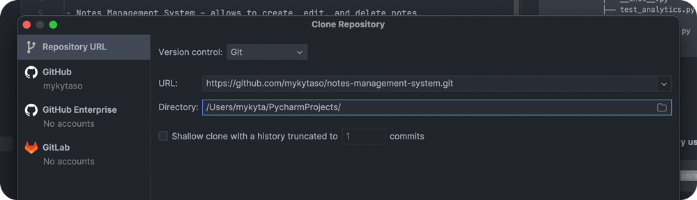
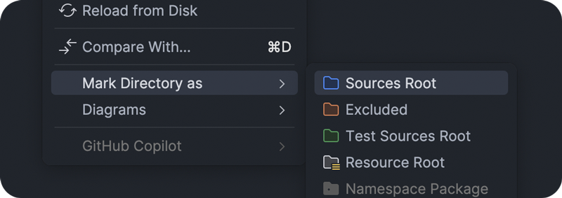

# SmartNotes

## An API service for managing notes with analytics and AI-powered summarization.

- SmartNotes – allows to create, edit, and delete notes.
- Automatic versioning: stores previous versions of notes during updates.
- AI summarization powered by Gemini API.
- Analytics:
  - Total word count across all notes
  - Average note length
  - Most common words or phrases
  - Identifies the top 3 longest and shortest notes

<br>

### Technologies Used
- **FastAPI** – Asynchronous web framework. 
- **Alchemy** – ORM for database interaction.
- **Alembic** – Database migrations.
- **Pydantic** – Data validation and serialization.
- **NLTK** – Natural language processing.
- **Gemini API** – AI summarization service.
- **Asyncio** – Asynchronous programming.

<br>


## 📋 &nbsp; Project Structure Overview

The project is structured to facilitate modular development and ease of maintenance.

```
.
├── .env.sample
├── .gitignore
├── pytest.ini
├── README.md
├── requirements.txt
├── media
└── src
    ├── config
    │   ├── __init__.py
    │   └── settings.py
    ├── database
    │   ├── __init__.py
    │   ├── models.py
    │   ├── session.py
    │   └── source
    │       ├── __init__.py
    │       └── notes.db
    ├── main.py
    ├── routes
    │   ├── __init__.py
    │   ├── analytics.py
    │   ├── notes.py
    │   └── versions.py
    ├── schemas
    │   ├── __init__.py
    │   ├── notes.py
    │   └── versions.py
    ├── services
    │   ├── __init__.py
    │   ├── analytics.py
    │   └── genai.py
    └── tests
        ├── __init__.py
        ├── conftest.py
        └── test_unit_integration
            ├── __init__.py
            ├── test_analytics.py
            ├── test_notes.py
            └── test_versions.py
            
```

<br>


## 📦 &nbsp; Installation

1. **Clone the repository, preferably using your IDE rather than the terminal:**
    ```shell
    git clone https://github.com/mykytaso/SmartNotes.git
    ```
    
    
    
2. **Please make sure to set the `src` directory as the `Source Root` in your IDE.**
    
    


3. **Create and activate a virtual environment:**
    ```shell
    python3 -m venv .venv
    source .venv/bin/activate
    ```
    
    
4. **Install the required dependencies:**
    ```shell
   pip install -r requirements.txt
    ```


5. **Set up environment variables:**
   - Create a `.env` file.
   - Copy the content from `.env.sample` to `.env`.
   - Update the values in `.env` with your specific configuration.


6.  **Run the application** (please run the following commands in your `terminal`):
    
    ```shell
    cd src
    ```
    ```shell
    uvicorn main:app --reload
    ```

<br>


## 📡 &nbsp; Available Endpoints

- `/docs` [GET] – View the API documentation.
<br>

- `/api/v1/notes` [GET] – Retrieve a list of notes.
- `/api/v1/notes` [POST] – Create a new note.
- `/api/v1/notes/{note_id}` [GET] – Retrieve a specific note by ID.
- `/api/v1/notes/{note_id}` [PUT] – Update an existing note by ID.
- `/api/v1/notes/{note_id}` [DELETE] – Delete a note by ID.
<br>


- `/api/v1/versions/{note_id}` [GET] – Retrieve all versions of a note.
- `/api/v1/versions/{note_id}/{version_id}` [GET] – Retrieve a specific version of a note.
- `/api/v1/versions/{note_id}/{version_id}` [DELETE] – Delete a specific version of a note.
<br>


- `/api/v1/analytics/summary/?note_id={int}&max_words={int}` [GET] – Get a summary of a note.
  - Optional parameter: `max_words` – The maximum number of words in the summary (default: 10).
- `/api/v1/analytics/total-words` [GET] – Get the total word count across all notes.
- `/api/v1/analytics/avg-note-length` [GET] – Get the average length of notes.
- `/api/v1/analytics/most-common-words-or-phrases/?max_phrase_length={int}` [GET] – Get the most common words or phrases across all notes.
  - Parameter: `max_phrase_length` – The maximum length of phrases to consider, ranging from 1 to 10 words (default: 3).
- `/api/v1/analytics/top-3-longest-notes` [GET] – Retrieve the top 3 longest notes.
- `/api/v1/analytics/top-3-shortest-notes` [GET] – Retrieve the top 3 shortest notes.
<br>

>**Example:** `http://127.0.0.1:8000/api/v1/notes`

<br>


## 🧪 &nbsp; Testing
- The project includes comprehensive unit and integration tests using `pytest`.
- Currently, **86%** of the codebase is covered by tests.

<br>

> **⚠️ IMPORTANT**: Set the environment variable `ENVIRONMENT=testing` in the `.env` file before running tests. This ensures that the tests use a **temporary in-memory database**.


To run the tests, use the following command:
```shell
  python -m pytest
```

<br>


## ✍️ &nbsp; Author
 Mykyta Soloviov <a href="https://github.com/mykytaso">@mykytaso</a>
